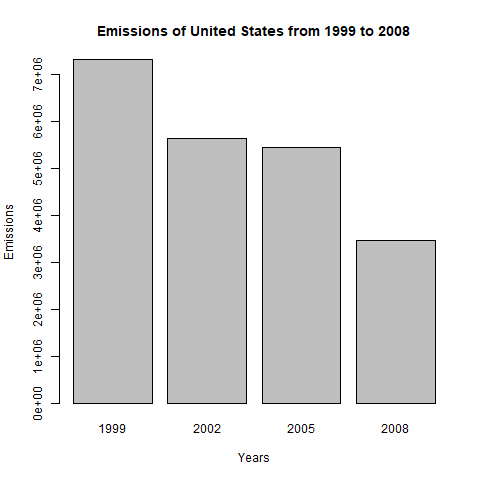
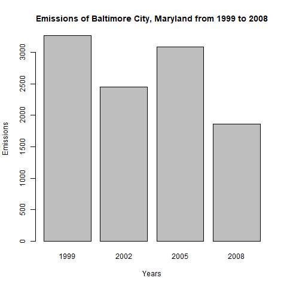
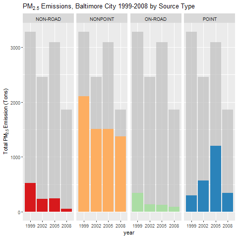
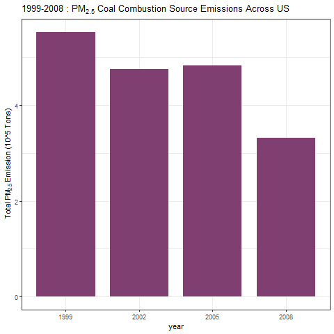
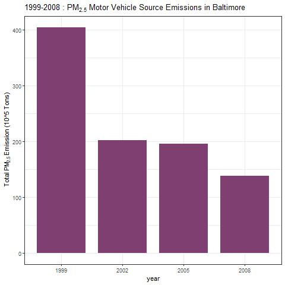
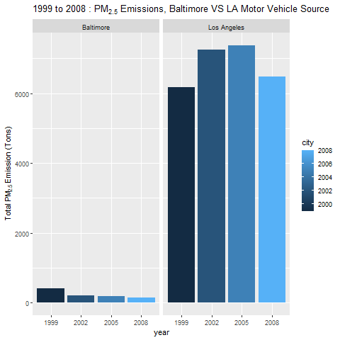

# Exploratory Data Analysis Week4 Project Assignment 2

### Loading library, downloading & unzipping file 

```ruby
library(dplyr)
library(ggplot2)

download.file(url = "https://d396qusza40orc.cloudfront.net/exdata%2Fdata%2FNEI_data.zip"
              , destfile = paste(path, "dataFiles.zip", sep = "/"))
unzip(zipfile = "dataFiles.zip")


## Loading data from .rds files
setwd("S04/W4_Assignment/")

NEI <- readRDS("data/summarySCC_PM25.rds")
SCC <- readRDS("data/Source_Classification_Code.rds")

```
## Question 1 ([plot1.R](plot1.R))
Have total emissions from PM2.5 decreased in the United States from 1999 to 2008? Using the base plotting system, make a plot showing the total PM2.5 emission from all sources for each of the years 1999, 2002, 2005, and 2008.

```ruby

# sum value of column "Emissions" by different year and assign to 'totalNEIbyYear' variable for plotting later

totalNEIbyYear <- select(NEI, c(year, Emissions)) %>%
                  group_by(year) %>%
                  summarize(year, Total_Emissions=sum(Emissions, na.rm = TRUE)) %>%
                  unique()


# creating .png file
png(filename='plot1.png')

# Making a plot to present the total PM2.5 emission from all sources for each of the years 1999, 2002, 2005, and 2008.
barplot(totalNEIbyYear$Total_Emissions
        , names = totalNEIbyYear$year
        , xlab = "Years", ylab = "Emissions"
        , main = "Emissions of United States from 1999 to 2008")

dev.off()

```
### plot1


## Question 2 ([plot2.R](plot2.R))
Have total emissions from PM2.5 decreased in the Baltimore City, Maryland (𝚏𝚒𝚙𝚜 == "𝟸𝟺𝟻𝟷𝟶") from 1999 to 2008? Use the base plotting system to make a plot answering this question.

```ruby
# sum value of column "Emissions" by different year with row filter (fips == '24510')
# and assign to 'totalNEIbyYear_Baltimore' variable for plotting later

totalNEIbyYear_Baltimore <- filter(NEI, fips == '24510' ) %>%
                            select(c(year, Emissions)) %>%
                            group_by(year) %>%
                            summarize(year, Total_Emissions=sum(Emissions, na.rm = TRUE)) %>%
                            unique()

# creating .png file
png(filename='plot2.png')

# Making a plot to present the total PM2.5 emission from all sources for each of the years 1999, 2002, 2005, and 2008.
barplot(totalNEIbyYear_Baltimore$Total_Emissions
        , names = totalNEIbyYear_Baltimore$ year
        , xlab = "Years", ylab = "Emissions"
        , main = "Emissions of Baltimore City, Maryland from 1999 to 2008")

dev.off()
```
### plot2


## Question 3 ([plot3.R](plot3.R))

Of the four types of sources indicated by the 𝚝𝚢𝚙𝚎 (point, nonpoint, onroad, nonroad) variable, which of these four sources have seen decreases in emissions from 1999–2008 for Baltimore City? Which have seen increases in emissions from 1999–2008? Use the ggplot2 plotting system to make a plot answer this question.

```ruby
# Subset NEI data by Baltimore
baltimoreNEI <- filter(NEI,fips=="24510")

# creating .png file
png("plot3.png")

ggplot(baltimoreNEI,aes(factor(year),Emissions,fill=type)) +
  geom_bar(stat="identity") +
  theme_gray() + guides(fill=FALSE)+
  gghighlight::gghighlight() + 
  scale_fill_brewer(palette="Spectral") +
  facet_grid(.~type,scales = "free",space="free") + 
  labs(x="year", y=expression("Total PM"[2.5]*" Emission (Tons)")) + 
  labs(title=expression("PM"[2.5]*" Emissions, Baltimore City 1999-2008 by Source Type"))

dev.off()
```
### plot3


## Question 4 ([plot4.R](plot4.R))

Across the United States, how have emissions from coal combustion-related sources changed from 1999–2008?

```ruby
# filter coal combustion-related sources from SCC 
coalcombustionSCC   <- filter(SCC, SCC.Level.One %like% "Combustion" & SCC.Level.Four %like% "Coal")

# NEI to Join data source with SCC id relates to coal combustion
coalcombustionNEI <- inner_join(NEI, coalcombustionSCC, by = "SCC") 

# creating .png file
png("plot4.png")

# creating a bar chart by using data with all combustion-related records from NEI
ggplot(coalcombustionNEI,aes(x = factor(year),y = Emissions/10^5)) +
  geom_bar(stat="identity", fill ="#7f3f70", width=0.8) +
  scale_fill_brewer(palette="Spectral") +
  theme_bw() + guides(fill=FALSE)+
  labs(x="year", y=expression("Total PM"[2.5]*" Emission (10^5 Tons)")) + 
  labs(title=expression("1999-2008 : PM"[2.5]*" Coal Combustion Source Emissions Across US"))

dev.off()
```
### plot4


## Question 5 ([plot5.R](plot5.R))

How have emissions from motor vehicle sources changed from 1999–2008 in Baltimore City?

```ruby
# filter motor vehicle sources from SCC 
motorV_SCC <- filter(SCC, SCC.Level.Three %like% "Motor Vehicle" | SCC.Level.Two %like% "Vehicle") %>%
              select(SCC)


# filter Baltimore City from NEI 
baltimoreNEI <- filter(NEI, fips == '24510') 

# to Join Baltimore City data source with SCC id relates to motor vehicle sources
baltimoreSCC <- inner_join(motorV_SCC, baltimoreNEI, by = "SCC")

# calculate total motor vehicle sources Emission of Baltimore City by different year (1999 to 2008)
NEIbaltimore_motorV <- select(baltimoreSCC, c(year, Emissions)) %>%
                       group_by(year) %>%
                       summarize(year, Total_Emissions=sum(Emissions, na.rm = TRUE)) %>%
                       unique()
# creating .png file
png("plot5.png")

# creating a bar chart by using data "NEIbaltimore_motorV"
ggplot(NEIbaltimore_motorV,aes(x = factor(year),y = Total_Emissions)) +
  geom_bar(stat="identity", fill ="#7f3f70", width=0.8) +
  scale_fill_brewer(palette="Spectral") +
  theme_bw() + guides(fill=FALSE)+
  labs(x="year", y=expression("Total PM"[2.5]*" Emission (10^5 Tons)")) + 
  labs(title=expression("1999-2008 : PM"[2.5]*" Motor Vehicle Source Emissions in Baltimore"))

dev.off()
```
### plot5


## Question 6 ([plot5.R](plot6.R))

Compare emissions from motor vehicle sources in Baltimore City with emissions from motor vehicle sources in Los Angeles County, California (𝚏𝚒𝚙𝚜 == "𝟶𝟼𝟶𝟹𝟽"). Which city has seen greater changes over time in motor vehicle emissions?

```ruby

# filter motor vehicle sources from SCC 
motorV_SCC <- filter(SCC, SCC.Level.Three %like% "Motor Vehicle" | SCC.Level.Two %like% "Vehicle") %>%
  select(SCC)


# filter Baltimore City from NEI & Los Angeles County
baltimoreNEI <- filter(NEI, fips == '24510') %>%
                mutate(city="Baltimore")

LANEI <- filter(NEI, fips == '06037') %>%
         mutate(city="Los Angeles")

LA_baltimoreNEI <- rbind(baltimoreNEI,LANEI)

table(LA_baltimoreNEI$city)


# to Join Baltimore City & LA data source with SCC id relates to motor vehicle sources
LA_baltimoreSCC <- inner_join(motorV_SCC, LA_baltimoreNEI, by = "SCC")

# calculate total motor vehicle sources Emission of Baltimore City & LA by different year (1999 to 2008)
NEIbaltimore_LA_motorV <- select(LA_baltimoreSCC, c(year,city,Emissions)) %>%
  group_by(year,city) %>%
  summarize(year, city, Total_Emissions=sum(Emissions, na.rm = TRUE)) %>%
  unique()


# creating .png file
png("plot6.png")

ggplot(NEIbaltimore_LA_motorV,aes(x = factor(year),y = Total_Emissions, fill=city)) +
  geom_bar(aes(fill=year),stat="identity") +
  theme(legend.position = "right") +
  facet_grid(.~city,scales = "free",space="free") + 
  labs(x="year", y=expression("Total PM"[2.5]*" Emission (Tons)")) + 
  labs(title=expression("1999 to 2008 : PM"[2.5]*" Emissions, Baltimore VS LA Motor Vehicle Source"))
  
dev.off()
```
### plot6

